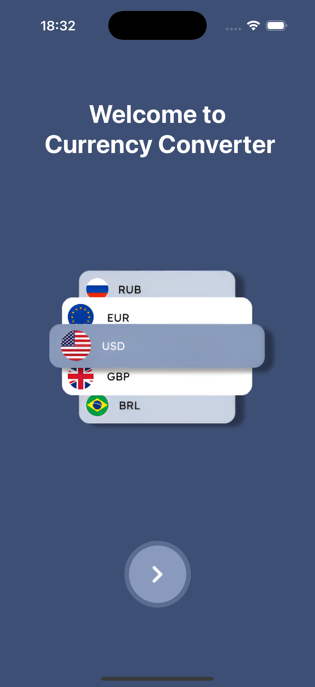
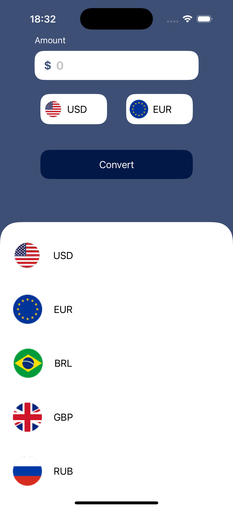
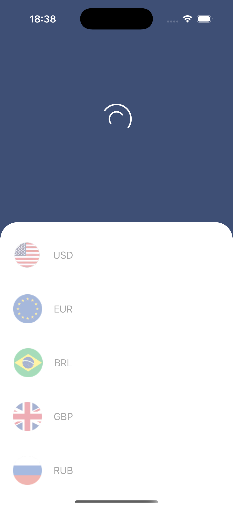
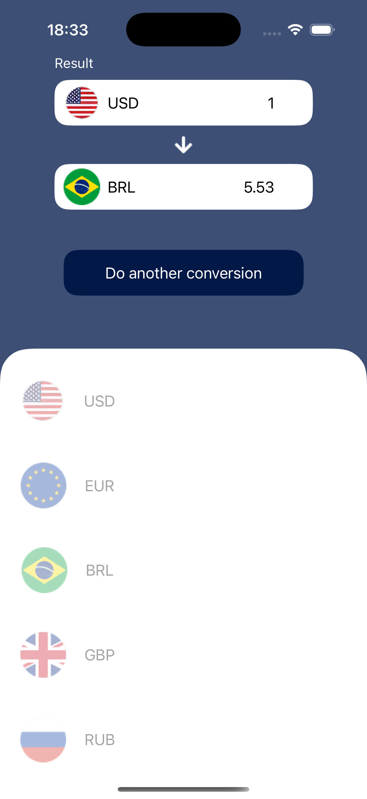

# ConverterApp-iOS

**ConverterApp-iOS** lets you convert currencies quickly and accurately on your iPhone or iPad.  
With a clean SwiftUI interface, just pick the currencies, type an amount, and get live results powered by AwesomeAPI. Perfect for travel, online shopping, or simply tracking exchange rates on the go.

---

## ✨ Features

| Feature | Details |
|---------|---------|
| **WelcomeScreen** | A smooth onboarding view that introduces the app and its main controls. |
| **ConverterScreen** | Real-time conversion: type an amount, choose base & target currencies, and see the result update instantly. |
| **Live Rates** | All quotes come from the [AwesomeAPI](https://docs.awesomeapi.com.br) endpoint, keeping conversions up-to-date. |
| **Haptic & Animation polish** | Subtle haptics and SwiftUI animations make every interaction feel responsive. |

---

## 📸 Screenshots

| Welcome | Converter | Loading | Result |
|---------|-----------|---------|--------|
|  |  |  |  |

---

## 🛠  Tech Stack

- **SwiftUI** – declarative UI, dark-mode ready.
- **MVVM** – clean separation of View, ViewModel and Repository layers.
- **Swift Concurrency (async/await)** – modern, lightweight networking with `URLSession`.
- **Combine** – reactive bindings between ViewModel and views.
- **Unit Tests with XCTest** – mocks and async tests covering the `CurrencyViewModel`.
---

## 🚀 Getting Started

1. **Clone the repo**

   ```bash
   git clone https://github.com/AllanAviana/ConverterApp-iOS.git
   cd ConverterApp-iOS
